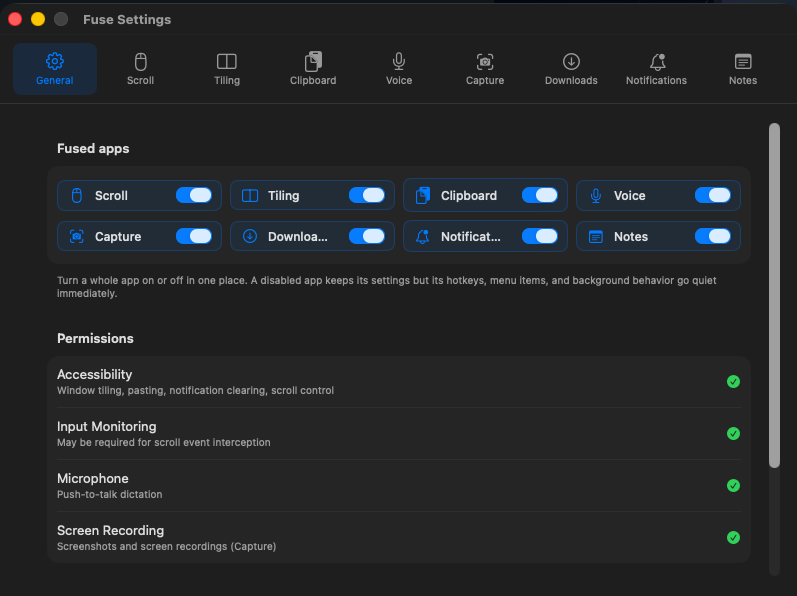

<div align="center">

# Fuse

**Eight Mac utilities. One menu-bar app.**

Push-to-talk dictation · window tiling · clipboard history · screen capture
video downloading · scroll control · notification clearing · quick notes




</div>

Fuse lives in your menu bar (no Dock icon) and replaces a drawer full of
single-purpose utilities. Every module can be switched off independently —
a disabled module keeps its settings but its hotkeys, menu items, and
background behavior go quiet immediately. One global pause silences
everything at once.

## The modules

| | Module | What it does |
|---|---|---|
| 🎙 | **Voice** | Hold a key, speak, release — your words are typed into whatever app has focus. Transcription runs **fully on-device** with [WhisperKit](https://github.com/argmaxinc/WhisperKit) (CoreML Whisper). Audio never leaves your Mac. |
| 🪟 | **Tiling** | Keyboard window management: halves, quarters, maximize, center, throw to next display. |
| 📋 | **Clipboard** | Searchable clipboard history with a paste picker. Skips password managers (`ConcealedType`), supports per-app exclusions, and pauses with the global pause. |
| 📸 | **Capture** | Region screenshots and screen recordings with a review window — annotate or trim, then Save, Copy, or Delete. Files land in `~/Pictures/Fuse Screenshots` and `~/Movies/Fuse Recordings`. |
| ⬇️ | **Downloads** | Paste a video URL, get a file — powered by `yt-dlp` with live progress in the menu bar. |
| 🖱 | **Scroll** | Per-device scroll direction control via a CGEvent tap — natural on the trackpad, traditional on the mouse. |
| 🔔 | **Notifications** | One keystroke sweeps every notification banner off your screen. |
| 📝 | **Notes** | A toggleable quick-notes panel, always one hotkey away. |

## Default hotkeys

All hotkeys are remappable in Settings.

| Action | Keys |
|---|---|
| Push-to-talk dictation (hold) | <kbd>⌃</kbd><kbd>⌥</kbd><kbd>Space</kbd> |
| Paste picker | <kbd>⌘</kbd><kbd>⇧</kbd><kbd>V</kbd> |
| Screenshot region | <kbd>⌃</kbd><kbd>⌥</kbd><kbd>S</kbd> |
| Start / stop recording | <kbd>⌃</kbd><kbd>⌥</kbd><kbd>R</kbd> |
| Tile halves | <kbd>⌃</kbd><kbd>⌥</kbd> + <kbd>←</kbd> <kbd>→</kbd> <kbd>↑</kbd> <kbd>↓</kbd> |
| Tile quarters | <kbd>⌃</kbd><kbd>⌥</kbd> + <kbd>1</kbd> <kbd>2</kbd> <kbd>3</kbd> <kbd>4</kbd> |
| Maximize / center / next display | <kbd>⌃</kbd><kbd>⌥</kbd> + <kbd>↩</kbd> / <kbd>C</kbd> / <kbd>N</kbd> |
| Clear all notifications | <kbd>⌃</kbd><kbd>⌥</kbd><kbd>⌫</kbd> |
| Quick notes panel | <kbd>⌃</kbd><kbd>⌥</kbd><kbd>M</kbd> |

## Install

**From a release DMG:** drag `Fuse.app` to Applications. Unsigned builds
need a one-time bypass: right-click `Fuse.app` → **Open** → **Open**
(or System Settings → Privacy & Security → **Open Anyway**).

**Build from source:**

```sh
brew bundle            # installs xcodegen
xcodegen generate
xcodebuild -project Fuse.xcodeproj -scheme Fuse -configuration Debug \
  -derivedDataPath .build build
open .build/Build/Products/Debug/Fuse.app
```

**Package a DMG:**

```sh
./scripts/release.sh
```

## Permissions

Fuse asks for each permission the first time the feature that needs it is
used — grant only what you use. The General tab shows live status.

| Permission | Used by |
|---|---|
| Accessibility | Tiling, pasting, notification clearing, scroll control |
| Input Monitoring | Scroll event interception |
| Microphone | Push-to-talk dictation |
| Screen Recording | Screenshots and screen recordings |

## Privacy

- **Dictation is local.** WhisperKit downloads a CoreML model once
  (from Hugging Face), then transcribes entirely on-device.
- **Clipboard history stays on disk, on your Mac** (SQLite via GRDB).
  Password-manager copies are never recorded; you can exclude any app.
- **No analytics, no network calls** except the ones you trigger
  (model download, video downloads).

## Development

```sh
xcodebuild -project Fuse.xcodeproj -scheme Fuse -derivedDataPath .build test
```

- `project.yml` is the source of truth — `Fuse.xcodeproj`, `Info.plist`,
  and entitlements are generated by [XcodeGen](https://github.com/yonaskolb/XcodeGen).
- Dependencies: [KeyboardShortcuts](https://github.com/sindresorhus/KeyboardShortcuts),
  [WhisperKit](https://github.com/argmaxinc/WhisperKit),
  [GRDB](https://github.com/groue/GRDB.swift).
- Design docs and phase plans live in `docs/superpowers/plans/`.

---

<div align="center">
Made for Apple Silicon Macs running macOS 14 Sonoma or later.
</div>
